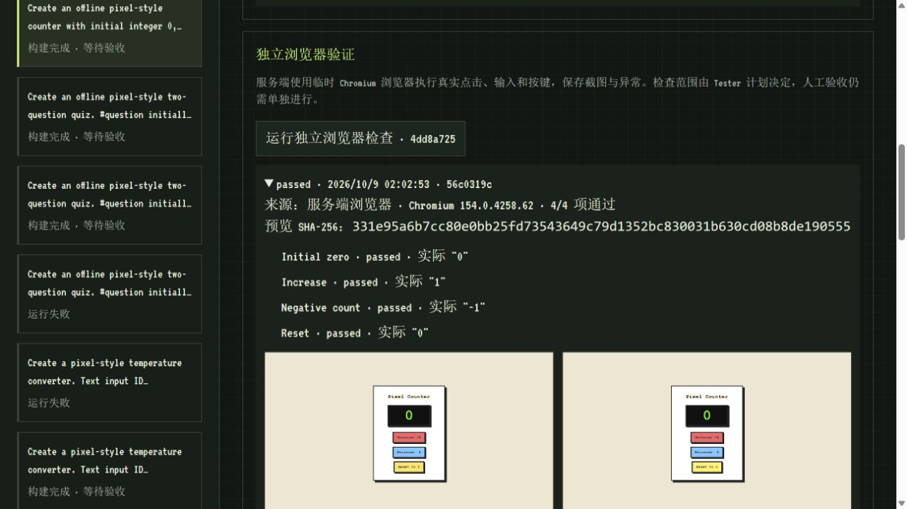
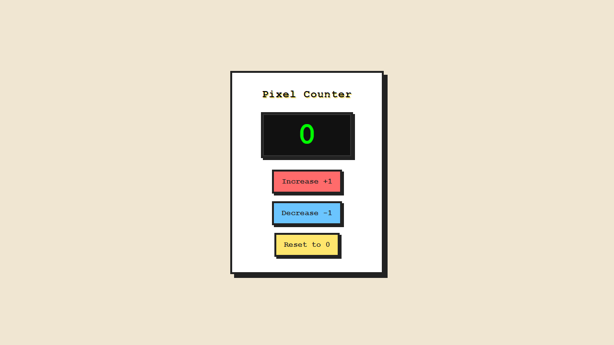
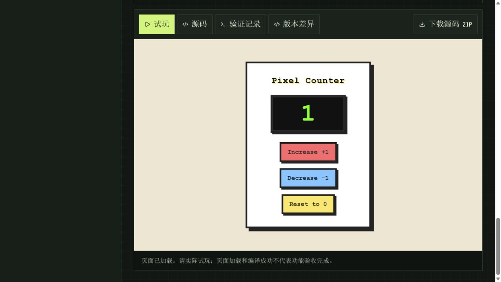

# PixelAgent Hub — 个人项目作品集

## 可直接使用的项目介绍

**项目名称：PixelAgent Hub · 多 Agent 软件生成与验收工作台**

基于 TypeScript、Node.js 和 React 开发的个人项目。用户提交需求后，Manager 规划、Coder 生成离线网页源码，构建器实际编译并反馈错误。工作台提供阶段可视化、沙箱试玩、源码 ZIP、版本对比，以及独立浏览器检查与截图。已有项目可追加需求或根据保存的失败证据创建返修版本，原版本与原检查记录保留，人工验收单独记录。

工程实现包括可配置模型接入、异步队列、取消与超时、进程中断恢复、API 鉴权、限流、初次创建幂等保护、OpenAPI 契约回归及 Docker 部署。项目用于展示 AI 工具集成、前后端实现、自动化检查和可复现交付能力。

以上是项目功能描述。个人承担的设计、开发与维护职责应按实际情况填写；不将开源借鉴、AI 协助或本地实验写成客户项目经历。

## 技术栈与可验证能力

| 技术 | 项目中的用途 |
| --- | --- |
| TypeScript / Node.js | Agent 编排、HTTP API、文件记录、任务控制 |
| React 19 / Vite 7 | 像素风工作台、阶段、预览、版本与检查界面 |
| esbuild | 编译离线 HTML/CSS/JS，导出独立预览 |
| Playwright / Chromium | 独立沙箱中的实际交互、断言与截图 |
| Node test / Vitest / OpenAPI | 核心、前端与实际 HTTP 契约回归 |
| Docker Compose / GitHub Actions | 本机容器部署、多平台构建与检查 |

## 展示案例

- **生成与试玩**：[真实模型实测](../software-studio/benchmark-results/2026-10-09/README.md)包含计数器、任务列表、计算器、单位换算、答题应用。10 次生成均首次编译通过；原始浏览器检查 6 次通过、4 次失败，后续平台与检查计划修复保留独立记录。单轮小样本不能代表通用成功率。
- **证据驱动返修**：[真实模型返修实验](../software-studio/benchmark-results/2026-10-09-real-repair-source-context/README.md)在真实生成的计数器副本中注入“增加 2”的故障。浏览器检查捕获失败，模型修复一行，其他三个文件不变；原计划 4/4、另加检查 7/7 通过。这是受控故障实验，不是客户案例。
- **交付与部署**：[同源启动](../software-studio/local-start.md)、[Docker 部署](../software-studio/docker-start.md)、[API 集成](../software-studio/api-integration.md)可复现工作台、鉴权和源码交付。





## 五分钟演示

使用 Node 22.12+，在 `pixelagent-hub/` 执行：

```sh
npm ci
npm --prefix dashboard ci
npm run build:all
npm run portfolio:demo
```

打开 `http://127.0.0.1:3131/studio`。无需配置模型密钥或安装浏览器；演示展示已保存结果，不现场生成测试结果。端口冲突时通过环境变量 `PORTFOLIO_DEMO_PORT` 指定空闲端口。

1. 打开初始版本，点击加、减、重置，说明沙箱内运行的是可执行作品。
2. 打开故障版本 `241b1e61-5fc8-4e5a-b4a7-8ccf22855ef0`，展示实际增加 2 和保存的失败检查。
3. 打开修复版本 `892470f0-592a-42d8-9951-b5e7caafe96c`，试玩增加 1，展示已保存的 4/4 与额外 7/7 检查、截图和模型记录。
4. 查看版本历史与源码对比：修复单行；下载源码 ZIP，解压打开 `preview/index.html`，无需依赖安装。
5. 明确说明：故障是实验注入，检查仅覆盖计划中的行为，页面“等待验收”表示尚未人工批准。

脚本验证预览和计划哈希，复制原始证据到独立临时目录，正常退出后清理副本；强制终止进程可能留下系统临时目录。演示中的保存或版本选择只影响临时数据。不要点击创建、返修或生成计划：该演示固定使用 mock，独立浏览器执行关闭。现场真实生成请使用正常启动流程并配置模型与 Chromium。



## 接单方向与交付约定

适合用本项目展示：React 管理界面、Node.js API、模型接口接入、Agent 工作流、浏览器自动化检查，以及简单离线工具或小游戏。具体承接范围应结合个人能力另行确认，不承诺工作台自动完成复杂全栈系统。

需求确认时列出页面、操作、输入输出和验收条件；报价按明确范围与里程碑确定。建议交付源码、运行说明、预览、检查记录与已知限制。登录、支付、数据库、部署托管、持续运维和模型费用需单独约定。不得以演示样本宣称所有任务成功或无人验收即可上线。

**接单沟通文案：**

> 我的个人项目 PixelAgent Hub 实现了多 Agent 需求规划、离线网页源码生成、编译和浏览器验收流程，支持版本返修与源码交付。仓库提供实际模型结果、失败记录和可运行演示，可展示 TypeScript/React、Node.js API 与 AI 工具集成能力。可以先确认您的功能范围、技术要求和验收标准，再确定交付方案与周期。

[GitHub 仓库](https://github.com/3617375681/PIXELAGENT-HUB)。将本页内容按平台字段填写，并优先选取上方实测截图；勿上传 `.env`、密钥、私人日志或未经确认的客户资料。
