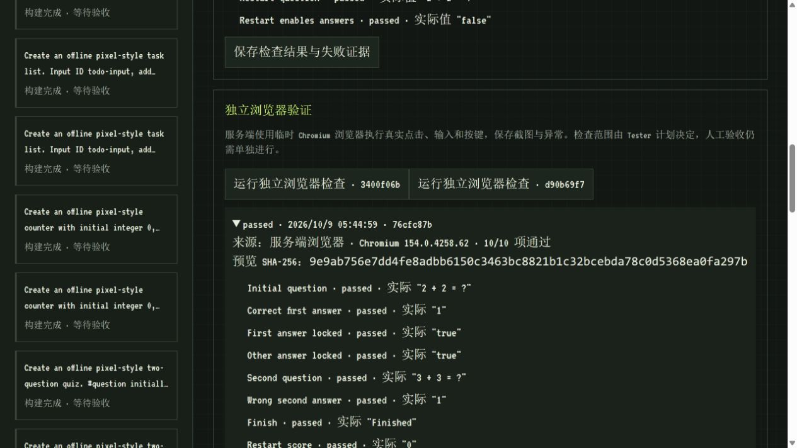

# Revised quiz checks — 2026-10-09

This is a new fixed plan applied to the two unchanged real-model quiz applications from [the original evaluation](../2026-10-09/README.md). It is not a new generation or a model repair. No model calls were made.

The previous plan attempted a second click on an answer that the applications correctly disabled. The revised plan asserts native `:disabled` state for both answers after answering, and checks that restart enables the first answer. Text checks still cover score, questions, completion and reset. The second answer's state after restart remains outside this ten-check plan.

Both applications pass **10/10** in installed Edge Chromium 154.0.4258.62. [results.json](results.json) links the original failed runs to the new plans and runs. Each strategy directory contains its saved plan, browser report and initial/final PNGs. Preview hashes match the original artifacts; original project JSON, source ZIP and failure reports remained byte-identical. The original benchmark collector still reports both original quiz entries as failed because they reference the original plan IDs.

The production schema accepts only `text` or `disabled` assertions; disabled expected values are the strings `true` or `false`. Both executors use the same native CSS predicate. A real-browser regression checks enabled, locked, incorrect-state and reset cases. Legacy text plans retain their normalized hashes. State checks do not establish visual quality, accessibility, complete requirements coverage or manual approval.

The workbench also executed this revised Manager/Coder quiz plan in the client sandbox: 10/10 checks passed, including both locked answers and reset to enabled. No client diagnostic or manual approval was saved. The UI displayed the new plan's state labels, the independent 10/10 report and the retained original failure.

Validation: framework build; 136 ordinary core tests passed with six opt-in browser tests skipped; 31 browser/API tests passed; dashboard type check, 23 tests and production build passed.

[Client sandbox screenshot](../../../../../portfolio-screenshots/studio-quiz-disabled-client-2026-10-09.png)
