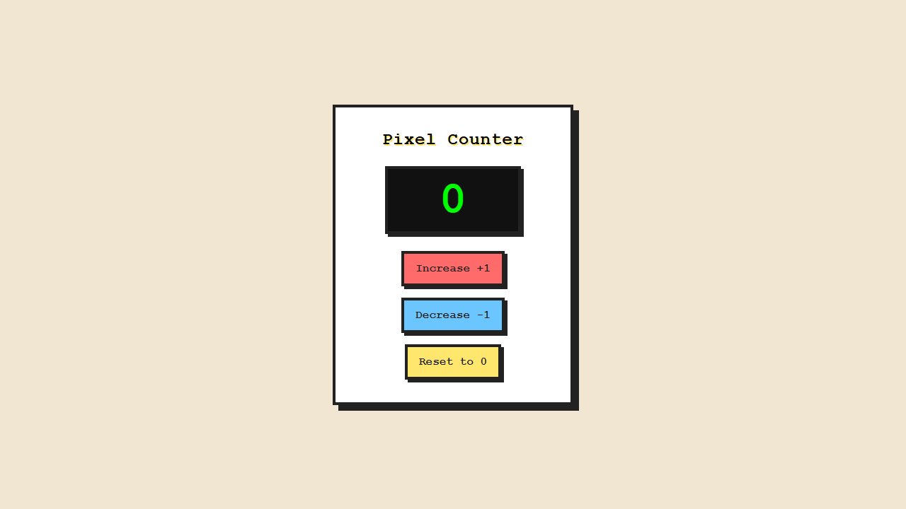

# Real-model browser repair — 2026-10-09

This is a **controlled fault-injection experiment**, not a naturally occurring model failure or a replacement for the original benchmark. One counter application is sampled once on each implementation; the [follow-up](../2026-10-09-real-repair-source-context/README.md) tests the repair-context change motivated by this result.

## Method

The source is the real-model Manager/Coder counter `56ea9aa0-13fb-41be-8ddf-b9dfba65a46a` from the [original evaluation](../2026-10-09/README.md). On clean tracked source commit `94068807ef2a13ad124104f17d50837962289e83`, an unchanged copy is rebuilt and passes the four frozen counter checks. Another isolated copy changes exactly `count += 1;` to `count += 2;` in `script.js`. It compiles, but its independent browser run fails two checks: Increase observes `2` instead of `1`; the following negative-count check observes `0` instead of `-1`.

The production Studio HTTP handler and runtime run on an ephemeral loopback server, with the installed Edge executable and Chromium sandbox enabled. Only `{ browserRunId }` is posted to the repair endpoint. The server retrieves the failed report, plan, original source and matching hashes; real Manager/Coder tasks generate a separate version. API authentication is outside this isolated handler experiment; existing authentication is not evaluated here. No Tester model call or automatic retry is used.

The repaired source is checked using the same four frozen checks. A separate seven-check plan, withheld from model context, tests a different operation order, repeated increments, negative values, reset, native Enter and Space activation. Plans and browser results are saved for each stage; passing does not approve the project.

## Observed result

| Stage | Build | Independent browser checks |
| --- | --- | --- |
| Unchanged copy | Passed | 4/4 |
| Injected fault | Passed | 2/4; failed |
| Real-model repair | Passed on first attempt | 4/4; additional 7/7 |

Repair model: `deepseek/deepseek-v4-pro`. Generation took **89.519 seconds**, with **11,909 reported tokens**, two returned role tasks, no missing usage and one build. Actual monetary cost is unknown (`costUsd: null`). These figures exclude browser execution and original generation; returned tasks are not an audited count of provider HTTP requests.

The repair fixed behavior, but also changed `README.md` and `styles.css` alongside `script.js`; only `index.html` stayed byte-identical. It introduced a duplicate-initialization guard although the injected failure was an incorrect increment. The screenshots show changed dimensions and output styling. This exposed unnecessary changes that the four functional assertions could not reject, motivating source-aware planning and explicit instructions to preserve unrelated files.

## Evidence and limits

[evaluation.json](evaluation.json) retains IDs, linkage, source hashes, metrics and full file changes. [archive-hashes.json](archive-hashes.json) explicitly describes its hash encoding. The `baseline/`, `fault/` and `repaired/` directories contain project snapshots, source ZIPs, normalized plans, browser reports and initial/final screenshots. Preview hashes and normalized plan hashes were checked against exported artifacts; original project files and the fault copy remained unchanged after repair.

This single application and injected fault do not establish general repair reliability, multi-agent superiority, complete requirements coverage, visual quality or accessibility. The extra keyboard checks are limited to native buttons. No manual approval or deployment was performed. ZIPs are experiment artifacts for inspection.

