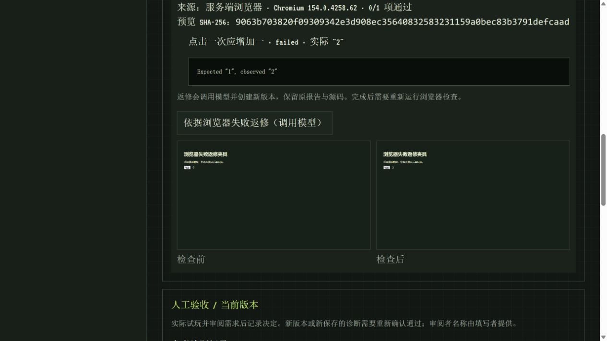
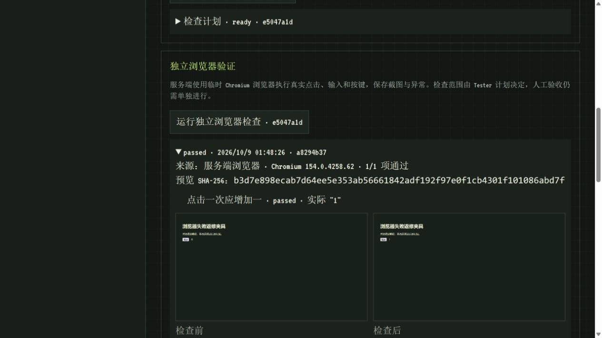

# Browser failure repair evidence — 2026-10-09

This verifies the workflow with controlled local model responses, not real model quality. The production Records stack and dashboard executed the normal generation, planning, browser checking and repair APIs. Browser operations used installed Edge Chromium 154.0.4258.62 on Windows.

## Observed workflow

1. Created project `7032d408-aac1-4475-af74-3b97814ced5d` through the workbench. Its counter deliberately adds two instead of one.
2. Generated plan `ad8dad56-d833-4685-a0c5-19fce5777ea0`, then clicked the independent browser check button. Run `aa78272c-a01e-4c8f-9113-151c0035868d` failed: clicking `#add` produced `#count` text `2`, expected `1`.
3. Clicked the browser-failure repair button. New project `1ec51605-3e77-4639-b14f-60ba82d4c592` retained the parent, browser run and plan IDs in its repair metadata. Its generated counter adds one.
4. Generated a fresh plan `e5047a1d-bd4b-4e13-9b92-fe1b9bbeeed0`. Browser run `a8294b37-563e-4a6c-94c0-0721ef5d9659` passed, observing `1`. Both reports displayed their before/after PNGs in the dashboard. Generation remained `ready_for_review`; no manual approval was recorded.

Original preview SHA-256: `9063b703820f09309342e3d908ec35640832583231159a0bec83b3791defcaad`.
Repaired preview SHA-256: `b3d7e898ecab7d64ee5e353ab56661842adf192f97e0f1cb4301f101086abd7f`.

## Automated validation

The opt-in browser/API suite passed all 24 tests. The repair integration test executes actual clicks before and after repair, checks the repair prompt includes original files and observed failure, and verifies the original project JSON, source ZIP and failed report remain byte-identical. Candidate selection remains on the original version; passing or foreign reports cannot initiate repair.

Guard tests reject changed preview/plan hashes, missing plans/screenshots, launch errors, timeouts and caller-invented error fields without model calls. The test observer now allows browser jobs their existing 45-second execution limit plus cleanup, rather than prematurely failing after 15 seconds; result assertions remain unchanged.

Framework build and ordinary tests passed (134 passed, three opt-in browser tests skipped). Dashboard type checking, 22 tests and production build passed. This does not establish visual quality, comprehensive requirements coverage or reliable repair by a real model. Planning, repair and retesting remain explicit user actions.
