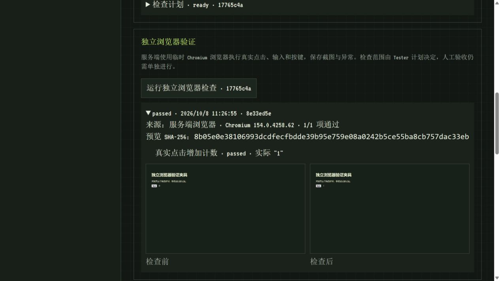

# Browser verification evidence — 2026-10-08

This is controlled software verification, not evidence of model-generated project quality. The page and Tester plan were explicitly seeded fixtures; execution used the production Records stack and real installed Edge Chromium 154.0.4258.62 on Windows.

- Project: `aedbb3bf-a1b5-43e2-b503-cb9e1f2edc8b`.
- Saved plan: `17765c4a-2186-4ab7-bfed-95d661a4c9d3`.
- Browser run: `8e33ed5e-5533-4f78-8a40-6e255698a824`.
- Preview SHA-256: `8b05e0e38106993dcdfecfbdde39b95e759e08a0242b5ce55ba8cb757dac33eb`.

Clicked the workbench's independent browser check button. The server created a new browser run, clicked `#add`, observed exact text `1`, and saved initial/final PNGs. The workbench displayed `passed`, the browser version, hash and actual result; both PNGs loaded through the API. The generation remained `ready_for_review` and manual approval stayed unset.

Automated tests additionally execute real click/fill/Enter actions, retain thrown runtime errors, detect text mismatch, block a deliberately attempted HTTP request, enforce timeout/cancellation and preserve reports through separate reads. HTTP integration checks verify PNG content and that `project.json` and `source.zip` stay byte-identical. Browser launch tests require explicit opt-in; dedicated CI installs matching Chromium. This does not cover multiple browsers, visual regression, all generated products or hostile tenant isolation.
