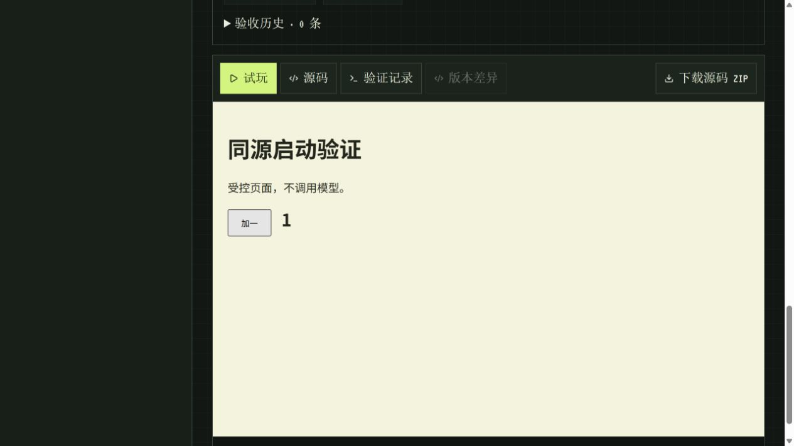

# 同源本地启动

从仓库克隆运行完整工作台，使用 Node 22.12+。在 `pixelagent-hub/` 安装两份依赖并配置 `.env`：

```sh
npm ci
npm --prefix dashboard ci
npm run studio:doctor
npm run build:all
npm start
```

打开 `http://127.0.0.1:3100/studio`。一个 Node 服务同时提供构建后的 Dashboard、Records API 和健康检查；关闭终端或 Ctrl+C 停止服务。端口取自 `RECORDS_API_PORT`，启动输出显示实际地址。此模式监听本机 `127.0.0.1`，用于个人本地使用。

真实生成需要配置 provider 和密钥；离线流程演示可在 `.env` 显式设置 `LLM_PROVIDER=mock`，不能作为真实生成验收。复制示例文件后请替换所选 provider 的占位密钥。独立浏览器检查仍需安装 Chromium 并启用 `ENABLE_STUDIO_BROWSER_CHECKS=true`，详见 [环境检查](environment-check.md)。

## 配置与开发

- Dashboard 的 `VITE_RECORDS_API_URL` 留空，使用当前页面同源的 `/api`。它属于构建时配置；修改后重新执行 `npm run build:all`。已有指向其他服务的配置不会被启动命令覆盖。
- API 鉴权继续遵循 `ALLOW_UNAUTH_IN_DEV` 和 `RECORDS_API_KEY`。启用鉴权时，个人 Dashboard 需在 `dashboard/.env.local` 配置对应的 `VITE_RECORDS_API_KEY` 后重构建；这个值会进入浏览器代码，不应把该构建作为公共站点共享。
- 保存记录的位置与 API 启动方式相同；CLI 生成目录仍独立。查看 CLI 作品时，按 [工作室说明](README.md) 配置 `STUDIO_ROOT_OVERRIDE`。
- 修改源码后再次运行 `npm run build:all`，重启服务加载新的后端。需要热更新时，仍使用两个终端分别运行 `npm run records:api` 和 `npm run ui:dev`。
- `npm run records:api` 和不带 `--dashboard` 的编译服务入口继续只提供 API。Docker 的现有 Nginx 部署方式保持独立。

没有 `dashboard/dist/public/index.html` 时，启动明确提示先构建，不显示一个缺少页面的成功服务。该命令面向仓库检出；当前 npm 包清单不包含 Dashboard 构建产物。

## 路由与验证

刷新 `/studio/<项目UUID>` 等无扩展名页面会返回 SPA 入口。`/api`、`/health` 交给 API，不将错误响应替换成网页。缺失静态资源返回 404；只允许 GET/HEAD，不列目录，不提供点文件或 source map，并通过实际路径检查拒绝越出构建目录的符号链接。

```sh
npm run smoke:dashboard
```

该检查用已编译的实际入口和 Dashboard 构建启动临时本机服务，验证首页资源、深层链接刷新、readiness、空 Studio 列表和 API 404，随后关闭服务并清理自己的临时记录。不会调用模型。HTTP 回归另覆盖鉴权、MIME、HEAD、非法路径和符号链接。它不证明生成应用质量，也不替代作品的浏览器检查。

## 本机验证（2026-10-09）

Windows / Node 24.21.0：`npm run build:all`、编译后的启动 smoke 和 145 项核心测试通过，七项可选浏览器测试按默认设置跳过。Vite 构建保留原有代码高亮分包大小提示。CI 的 Dashboard 任务增加核心安装、编译及同源启动 smoke；核心各平台测试包括五项静态路由 HTTP 回归。

另用 `npm start` 在隔离记录目录和 3129 端口启动服务，浏览器加载 Studio 列表，打开受控项目、刷新深层链接后恢复详情，并在预览中点击按钮使计数从 0 变为 1。项目由本地固定源文件构建，明确标注“受控页面，不调用模型”；没有生成模型调用、保存诊断或人工批准。这一验证证明构建后的页面、同源 API 和沙箱预览能一起工作，不用于评价模型生成质量。测试服务随后关闭。


